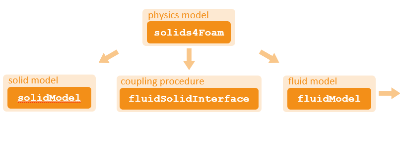
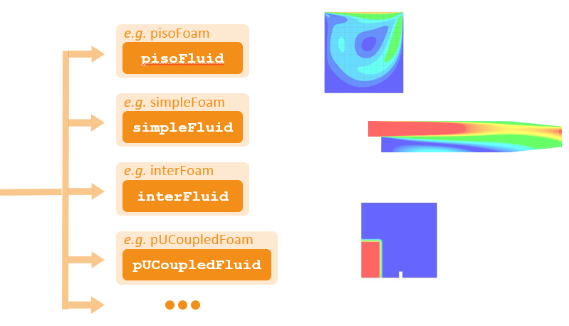
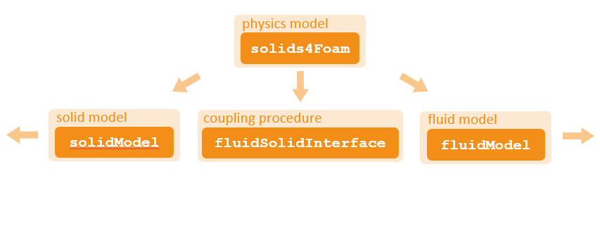
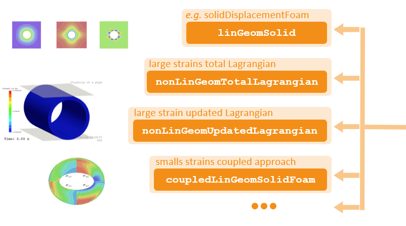
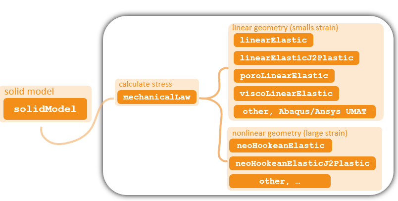
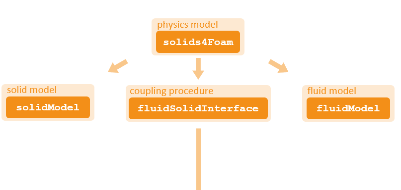
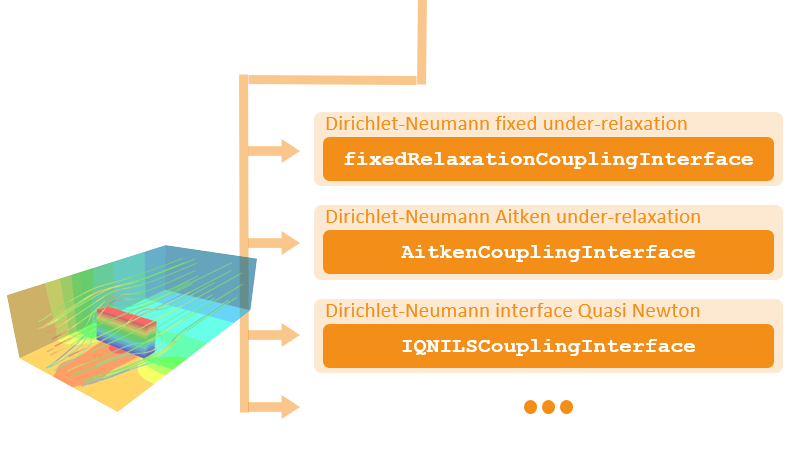
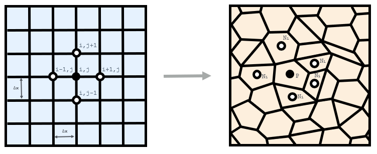
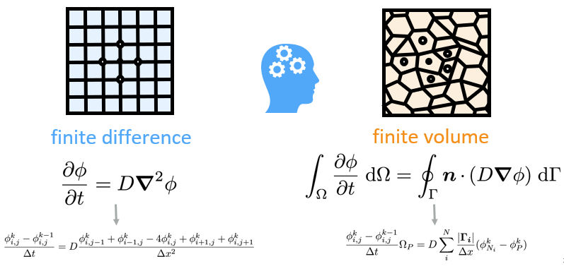
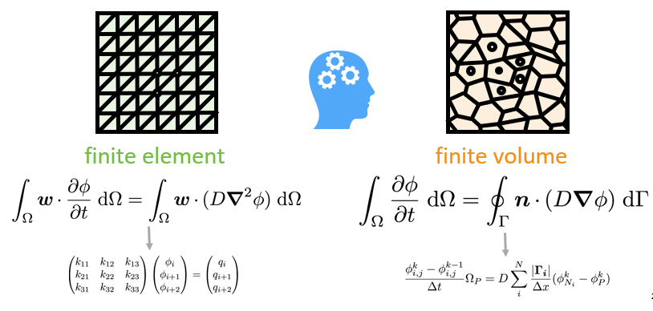

# Overview

---

## Overall Aim

The solids4foam project aims is to develop an OpenFOAM toolbox for solid mechanics and fluid-solid interactions that is:
- intuitive to **use** for new users
- easy to **understand** at the case and code level
- straightforward to **maintain**
- uncomplicated to **extend**

In addition, the toolbox should be compatible will all major OpenFOAM forks, as far as reasonably possible.

solids4foam builds on the toolboxes *stressAnalysis*, *solidMechanics* and *extendBazaar*

---

## Modular Approach















---

## Coding Style

When consistent style is not followed, reading code generated by others becomes tedious, painstaking and even impossible. Coding style is a crucial feature of software that is easy to read, understand, maintain and extend. Fortunately, the OpenFOAM Foundation have set out a comprehensive coding style at [https://openfoam.org/dev/coding-style-guide](https://openfoam.org/dev/coding-style-guide).

### Bad
```
Info <<“This is not good”
<< endl;

( a+b ) * ( c&d ) / (e&&f)

if(myName == “Philip”){
success = true;
}

…
```
### Good
```
Info<< “That’s better”
    << endl;

(a + b)*(c & d)/(e && f)

if (myName == “Philip”)
{
    success = true;
}

…
```

---

## Finite Volume vs Finite Difference vs Finite Element



The finite volume method is a generalisation of the finite difference method, in terms of geometry and topology, but the methods differ in their philosophy.



